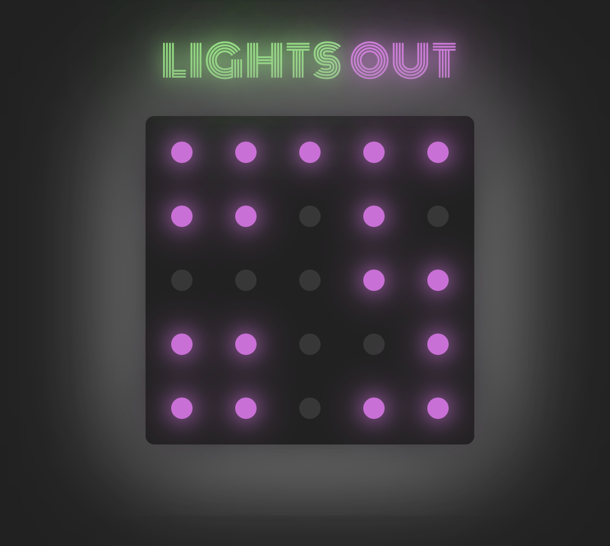

# One Light

## License
### 
### [MIT](https://opensource.org/licenses/MIT)

## Description

5x5 classic "Lights Out" game created with React and Css. I built this to refresh and expand my knowledge of React and Javascript.

By: [Vincent Toon](https://github.com/Vincenttoon)

## Table of Contents

* [Live Deployment](#live-deployment)

* [Rules](#rules)

* [Future Improvements](#future-improvements)

* [Questions?](#questions)

## Live Deployment

- [One Light Live Deployment](https://one-light-vwtd.vercel.app/)

## Rules

1. Board opens fully lit. 
2. User must touch the cells to turn on/off the lights. 
3. Each cell touches the four (up, down, left, right) cells around it.
4. Play until board is completely dark (or for now, down to one lit piece).
5. Celebrate victory!

## Future Improvements

- Create randomly generated board for that will always succeed and leave board fully dark. "Dancing Links" algorithm suggested in research.
- Light and dark mode for users.
- Option for users to choose board size.

## Questions?

Questions, comments, or concerns? Please Email me at:
* vincenttoon22@gmail.com